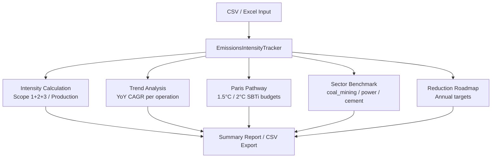

# Emissions Intensity Tracker


Scope 1, 2, and 3 greenhouse gas emissions intensity tracking for coal operations — with Paris-aligned pathway modelling, SBTi benchmarking, and carbon reduction roadmaps.

## Features

- **Emission intensity calculation** — tCO2e per tonne of production across Scope 1/2/3
- **Year-over-year trend analysis** — per-operation with CAGR tracking
- **Paris 1.5°C / 2°C pathway** — SBTi-aligned annual reduction budgets
- **Sector benchmarking** — compare against coal_mining, thermal_power, cement, steel
- **Carbon reduction roadmaps** — annual targets to a user-defined % reduction
- **EU CBAM cost estimation** — liability calculator for cross-border carbon adjustment
- **Net-zero pathway tracker** — IEA/SBTi/linear/exponential scenario support
- Supports CSV and Excel input formats

## Tech Stack

| Tool | Purpose |
|---|---|
| **Python 3.9+** | Core language |
| **pandas / numpy** | Data manipulation |
| **scipy** | Statistical calculations |
| **pytest** | Unit testing |

## Installation

**Step 1: Clone the repository**
```bash
git clone https://github.com/achmadnaufal/emissions-intensity-tracker.git
cd emissions-intensity-tracker
```

**Step 2: Install dependencies**
```bash
pip install -r requirements.txt
```

## Usage

**Step 3: Run with sample data**
```bash
python3 demo/run_demo.py
```

**Step 4: Use in your own code**
```python
from src.main import EmissionsIntensityTracker

tracker = EmissionsIntensityTracker()
df = tracker.load_data("data/extended_emissions_data.csv")

# Calculate intensities
df = tracker.calculate_emission_intensity(
    df,
    scope_cols=["scope1_tco2e", "scope2_tco2e", "scope3_tco2e"],
    production_col="production_tonnes"
)

# Paris 1.5°C pathway
pathway = tracker.calculate_paris_aligned_pathway(50000, scenario="1.5c")

# Benchmark against sector
bench = tracker.benchmark_against_sector(0.038, sector="coal_mining")
```

**Step 5: Export results**
```python
tracker.to_dataframe(result).to_csv("output.csv", index=False)
```

## Architecture



## Screenshots / Demo Output

```
$ python3 demo/run_demo.py
============================================================
  Emissions Intensity Tracker — Demo
============================================================

✓ Loaded 12 records from extended_emissions_data.csv
  Operations: 4 | Years: [2023, 2024, 2025]

✓ Calculated Scope 1+2+3 emission intensities
  Avg intensity: 0.3338 tCO2e/tonne
  Best performer: OP-AUSTRALIA-001 (0.2845 tCO2e/t)

✓ Year-over-year trend analysis (4 operations):
  Operation                   YoY Change    Avg Annual   Latest (tCO2e)
  -----------------------------------------------------------------
  OP-AUSTRALIA-001          ↓       9.3%        -4.64%         31,300.0
  OP-COLOMBIA-001           ↓       6.8%        -3.38%         19,300.0
  OP-KALIMANTAN-001         ↓       8.1%        -4.03%         25,100.0
  OP-SUMATRA-001            ↓       8.2%        -4.10%         17,900.0

✓ Paris 1.5°C Pathway (from 50,000 tCO2e baseline):
  Annual reduction rate : 4.2% CAGR (SBTi ACA)
  2030 budget           : 40,346 tCO2e
  2050 budget           : 17,104 tCO2e
  Total reduction       : 65.8% vs baseline

✓ Sector benchmark (coal_mining):
  Measured intensity    : 0.038 tCO2e/tonne
  Sector average        : 0.04 tCO2e/tonne
  Deviation from avg    : -5.0%
  Performance band      : ABOVE_AVERAGE

✓ Carbon reduction roadmap (25% in 5 years):
  Current intensity     : 0.038 tCO2e/unit
  Target intensity      : 0.0285 tCO2e/unit
  Year 1               : 0.0361 tCO2e/unit
  Year 2               : 0.0342 tCO2e/unit
  Year 3               : 0.0323 tCO2e/unit
  Year 4               : 0.0304 tCO2e/unit
  Year 5               : 0.0285 tCO2e/unit

============================================================
  ✅ Demo complete
============================================================
```

## Testing

```bash
pytest tests/ -v
```

## Contributing

See [CONTRIBUTING.md](CONTRIBUTING.md) for guidelines. PRs welcome — especially additional sector benchmarks, SBTi validation modules, and EU CBAM coverage extensions.

---

> Built by [Achmad Naufal](https://github.com/achmadnaufal) | Lead Data Analyst | Power BI · SQL · Python · GIS
